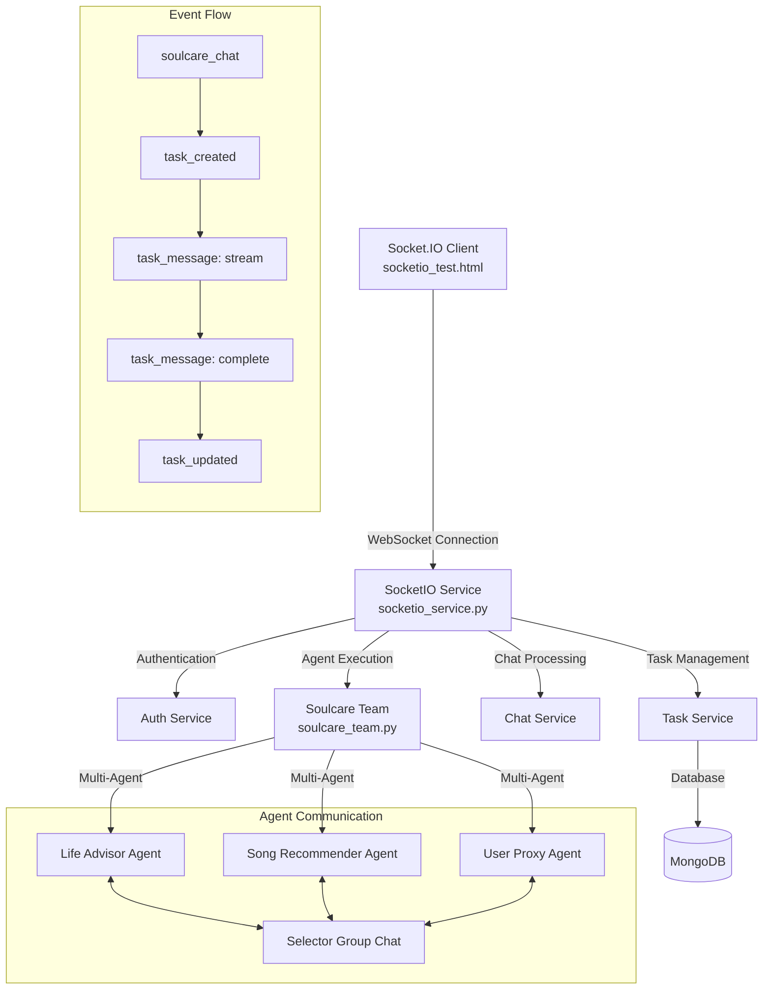

# Socket.IO Agent Service Documentation

## Overview

The Socket.IO Agent Service provides real-time streaming communication between clients and AI agent teams. It enables live chat interactions with specialized agent groups like the Soulcare Team, which consists of a Life Advisor and Song Recommender working together to provide emotional support and music recommendations.

## Architecture Overview

The system follows a layered architecture where the Socket.IO service orchestrates communication between web clients and AI agent teams through various service layers.



## Service Integration

### How SocketIOService Uses Other Services

The `SocketIOService` acts as the central coordinator and integrates with multiple services:

1. **AuthService**: Handles user authentication and token verification
   - Used during WebSocket connection establishment
   - Validates JWT tokens and retrieves user information

2. **TaskService**: Manages task lifecycle and conversation state
   - Creates soulcare tasks for agent processing
   - Stores and retrieves conversation state between sessions
   - Updates task status and saves agent states

3. **ChatService**: Processes regular chat messages (non-agent)
   - Handles traditional chat interactions
   - Creates tasks for standard conversation flows

4. **SoulcareTeam**: Manages multi-agent AI conversations
   - Coordinates between Life Advisor and Song Recommender agents
   - Provides streaming responses through AutoGen framework
   - Maintains conversation context and agent states

## Server-Side Event Handlers

### Connection Events

#### `connect(sid, environ, auth)`
- **Purpose**: Establishes authenticated WebSocket connection
- **Authentication**: Validates JWT token from `auth.token`
- **Actions**:
  - Verifies user token and retrieves user data
  - Creates user-specific room (`user_{user_id}`)
  - Stores session mapping (`sid -> user_id`)
  - Emits `connected` event with user information

#### `disconnect(sid)`
- **Purpose**: Cleanup when client disconnects
- **Actions**:
  - Removes user from session mapping
  - Leaves user-specific room
  - Logs disconnection

### Chat Events

#### `chat(sid, data)`
- **Purpose**: Handles regular chat messages
- **Validation**: Checks message format and authentication
- **Processing**: 
  - Creates `ChatRequest` object
  - Processes through `ChatService`
  - Emits error events for validation failures

#### `soulcare_chat(sid, data)`
- **Purpose**: Handles specialized soulcare agent interactions
- **Flow**:
  1. **Task Creation**: Creates soulcare task in database
  2. **Agent Initialization**: Sets up SoulcareTeam with AutoGen client
  3. **State Loading**: Retrieves previous conversation state if available
  4. **Agent Execution**: Runs multi-agent conversation with streaming
  5. **State Saving**: Persists agent state and conversation history

### Conversation Management

#### `join_conversation(sid, data)`
- **Purpose**: Allows users to join specific conversation rooms
- **Validation**: Verifies user access to conversation
- **Actions**: Adds user to conversation-specific room

#### `leave_conversation(sid, data)`
- **Purpose**: Removes user from conversation room
- **Actions**: Removes user from conversation-specific room

## Client-Side Event Handlers

### Connection Events

#### `connect`
- Updates UI connection status
- Enables chat functionality
- Logs connection success

#### `disconnect`
- Updates UI to disconnected state
- Disables chat controls
- Shows disconnection message

#### `connected`
- Displays welcome message with user information
- Confirms successful authentication

### Task and Agent Events

#### `task_created`
- **Purpose**: Notifies client that agent task was created
- **Actions**:
  - Displays task creation notification
  - **Auto-sets conversation ID** in UI input field
  - Logs task creation with ID

#### `task_message`
- **Purpose**: Streams real-time agent messages
- **Message Types**:
  - `start`: Task initialization message
  - `stream`: Live agent responses during conversation
  - `complete`: Task completion notification
  - `error`: Error messages during processing
- **Agent Identification**: Different styling for LifeAdvisor vs SongRecommender

#### `task_updated`
- **Purpose**: Notifies task status changes
- **Information**: Task ID, status, and completion message

### Error Handling

#### `error`
- Displays error messages in chat
- Logs error details for debugging

#### `connect_error`
- Handles connection failures
- Updates UI status and shows error message

## Data Structures

### Socket.IO Event Data

#### Task Created Event
```json
{
  "task_id": "string",
  "conversation_id": "string",
  "message": "Soulcare task created successfully"
}
```

#### Task Message Event
```json
{
  "task_id": "string",
  "type": "stream|start|complete|error",
  "data": {
    "message": "string",
    "agent": "LifeAdvisor|SongRecommender|system"
  }
}
```

#### Task Updated Event
```json
{
  "task_id": "string",
  "status": "completed|failed|in_progress",
  "message": "string"
}
```

### Soulcare Chat Request
```json
{
  "message": "string",
  "conversation_id": "string (optional)",
  "metadata": {
    "socket_session": "string",
    "realtime": true,
    "agent_type": "soulcare"
  }
}
```

### Agent State Structure
```json
{
  "conversation_history": [],
  "agent_states": {
    "LifeAdvisor": {},
    "SongRecommender": {},
    "UserProxy": {}
  },
  "selector_state": {},
  "turn_count": "number"
}
```

## Agent Streaming Flow

### Multi-Agent Conversation Process

1. **Initialization**
   - Client sends `soulcare_chat` event with user message
   - Server creates task and initializes SoulcareTeam
   - Previous conversation state loaded if available

2. **Agent Selection**
   - SelectorGroupChat determines appropriate agent
   - Selection based on conversation context and rules
   - Agents: LifeAdvisor → SongRecommender → UserProxy cycle

3. **Streaming Response**
   - Each agent message streamed in real-time
   - `task_message` events sent with `type: 'stream'`
   - Agent identification included for UI styling

4. **State Persistence**
   - Agent conversation state saved after completion
   - Enables context continuity across sessions
   - Stored in task's `agent_state` field

### Agent Roles

#### LifeAdvisor
- **Purpose**: Provides empathetic life guidance and emotional support
- **Behavior**: 
  - Asks thoughtful questions about user's situation
  - Provides supportive feedback
  - Suggests transition to music when appropriate

#### SongRecommender
- **Purpose**: Finds music matching user's emotional state
- **Tools**: `search_song()` function for music discovery
- **Behavior**: 
  - Analyzes conversation for emotional context
  - Searches and shares appropriate songs
  - Provides music recommendations

#### UserProxy
- **Purpose**: Represents user input and feedback in conversation
- **Behavior**: Handles handover points and user responses

## Room Management

### User Rooms
- **Format**: `user_{user_id}`
- **Purpose**: Direct messages to specific users
- **Usage**: Personal notifications and private communications

### Conversation Rooms
- **Format**: `conversation_{conversation_id}`
- **Purpose**: Multi-user conversations
- **Usage**: Shared conversation updates and group messaging

## Error Handling and Recovery

### Connection Errors
- Token validation failures result in immediate disconnection
- Authentication errors logged and reported to client
- Graceful fallback for service unavailability

### Agent Processing Errors
- Task marked as failed in database
- Error details saved in task metadata
- Client notified through `task_message` with `type: 'error'`

### State Management Errors
- Fallback to new conversation if state loading fails
- Error logging for debugging
- Continued operation without previous context

## Performance Considerations

### Database Optimization
- Indexed queries for conversation state retrieval
- Efficient task status updates
- Minimized data transfer through selective field projection

### Memory Management
- Session cleanup on disconnection
- Conversation state stored in database, not memory
- Agent instances created per request to avoid conflicts

### Real-time Optimization
- Streaming responses reduce perceived latency
- Efficient event batching for multiple message types
- Room-based targeting minimizes broadcast overhead

## Security Features

### Authentication
- JWT token validation on every connection
- User session mapping for request validation
- Automatic disconnection for invalid tokens

### Authorization
- User ownership verification for conversations
- Task access control through user ID validation
- Room membership validation before joins

### Data Protection
- Sensitive information filtered from logs
- Token details truncated in debug output
- User data validation before processing